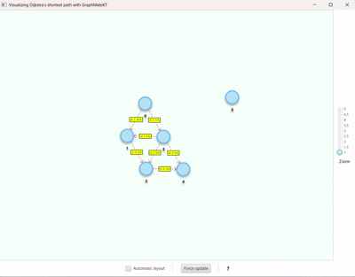

# graphMateKT


This repository contains classes and algorithms for making graphs, traversing and visualizing them.
This can for example be used to solve competitive programming problems.
The [solutions](src/main/kotlin/graphMateKT/solutions) folder contains code using this graphLibraryPackage to solve
various problems.
The library contains the general `Graph` class, which can be used to create graphs of any datatype,
the `IntGraph` class, which is performance optimized for integer nodes,
and the `Grid` class, where each node has x and y coordinates in addition to containing any data type.
All the classes inherit from the
abstract [BaseGraph](https://norskeaksel.github.io/GraphMateKT/graphmatekt/graphMateKT.graphClasses/-base-graph/index.html)
class, which defines the basic functionality of the graphs.

## Documentation

[](https://norskeaksel.github.io/GraphMateKT  )

## Using the library

Add the following dependency to your `pom.xml` file:

```xml

<dependency>
    <groupId>me.ahsor</groupId>
    <artifactId>graphmatekt</artifactId>
    <version>1.0-SNAPSHOT</version>
</dependency>
```

See [here](https://github.com/Norskeaksel/GraphMateKT/packages/) for the latest version number.

:warning: Please note that to use the ```Graph().visualizeGraph() function```, the files `smartgraph.css` and
`smartgraph.properties` **must be added manually** to the root of your project, as described
in [Bruno Silva](https://github.com/brunomnsilva)'s
[JavaFXSmartGraph](https://github.com/brunomnsilva/JavaFXSmartGraph) repository.

## The Graph class

A Graph data structure supports nodes of any datatype.

Any new node is given an ID upon creation, which is used to build an adjacency list. The class maintains internal
maps between IDs and nodes and vice versa. Nodes can be connected unidirectionally with `.addEdge(node1, node2)`
or bidirectionally with `.connect(node1, node2)`.
Once the graph is built, you may use the following graph algorithms:

- **Breadth-First Search (BFS)**:
    - `bfs(startNode: T, target: T? = null, reset: Boolean = true)`
    - `bfs(startNodes: List<T>, target: T? = null, reset: Boolean = true)`

- **Depth-First Search (DFS)**:
    - `dfs(startNode: T, reset: Boolean = true)`

- **Dijkstra's Algorithm**:
    - `dijkstra(startNode: T, target: T? = null)`

- **Floyd-Warshall Algorithm**:
    - `floydWarshall()`

- **Topological Sort**:
    - `topologicalSort()`

- **Strongly Connected Components (SCC)**:
    - `stronglyConnectedComponents()`

- **Prims (MST)**:
    - `minimumSpanningTree()`

[Example usage:](src/main/kotlin/graphMateKT/examples/GraphExample.kt)

```kotlin
package examples

import graphMateKT.graphClasses.Graph
import graphMateKT.graphClasses.IntGraph
import graphMateKT.graphGraphics.visualizeGraph


fun main() {
    // --- Example Graph Definition ---
    val graph = Graph()
    graph.addEdge(0, 1, 10.0)
    graph.addEdge(0, 2, 3.0)
    graph.addEdge(1, 3, 2.0)
    graph.addEdge(2, 1, 4.0)
    graph.addEdge(2, 3, 8.0)
    graph.addEdge(2, 4, 2.0)
    graph.addEdge(3, 4, 5.0)

    graph.addNode(5) // Adding an isolated node is also possible

    val startNode = 0
    val targetNode = 3
    graph.dijkstra(startNode, targetNode) // Provide a goal target node to stop the search when the target is found
    val nodes: List<Int> =
        graph.getNodes().map { it as Int } // Nodes are of type Any and must therefore be casted to Int
    println("Shortest paths from source node $startNode:")
    nodes.forEach { node ->
        val distValue = graph.distanceTo(node)
        val path = graph.getPath(node)
        println("To node $node: Distance $distValue Path: ${if (distValue < Int.MAX_VALUE) path else null}")
    }
    /* Output:
        Shortest paths from source node 0:
        Distance to node 0: 0.0 Path: [0]
        Distance to node 1: 7.0 Path: [0, 2, 1]
        Distance to node 2: 3.0 Path: [0, 2]
        Distance to node 3: 9.0 Path: [0, 2, 1, 3]
        Distance to node 4: 5.0 Path: [0, 2, 4]
        Distance to node 5: Infinity Path: null
        */


    /* --- Example IntGraph Definition ---
         * An IntGraph can be defined the same way as the Graph same way as above,
         * but it can also be initialized with a size, because the nodes are integers values from 0 to n-1.
    */

    val n = graph.size()
    val intGraph = IntGraph(n)
    // Add the same edges as the above Graph
    graph.getNodes().forEach { fromNode ->
        graph.getEdges(fromNode).forEach { edge ->
            val weight = edge.first
            val toNode = edge.second as Int // Cast type Any to Int
            intGraph.addEdge(fromNode as Int, toNode, weight)
        }
    }
    intGraph.dijkstra(startNode, targetNode)
    val intNodes: List<Int> = intGraph.getNodes()
    println("Shortest paths from source node $startNode:")
    intNodes.forEach { node ->
        val distValue = intGraph.distanceTo(node)
        val path = intGraph.getPath(node)
        println("To node $node: Distance $distValue Path: ${if (distValue < Int.MAX_VALUE) path else null}")
    }
    // Outputs the same as the code above

    // Visualize the graph using brunomnsilva's JavaFXSmartGraph: https://github.com/brunomnsilva/JavaFXSmartGraph
    graph.visualizeSearch( // Also works with intGraph.visualizeSearch(
        screenTitle = "Grid example visualizing",
        animationTicTimeOverride = 500.0,
        startPaused = false,
        closeOnEnd = false
    )
}
```



## The IntGraph class

The IntGraph class behaves a lot like the Graph class when used with integers like the example above. However,
it's more performant, because it does not need to maintain an internal mapping between the nodes and their indexes in
the adjacency list. The obvious drawback being it only supports integer nodes.
[Example usage.](src/main/kotlin/graphMateKT/examples/GraphExample.kt)

## The Grid class

The Grid class is a specialized graph class. It uses the data class:
```Tile(val x: Int, val y: Int, var data: Any? = null)```
to represent nodes of any datatype, where each node also have x and y coordinates.
The grid can be created with a width and height, or by passing a list of strings.
The grid can be traversed using the same algorithms as the graph class,
but it also has some additional methods for connecting the grid without explicitly adding
edges. `.connectGridDefault()` connects each node to nodes up, down, left and right of it, if they exist.
If some customization is needed, `.connectGrid(::yourCustomFunction)` (also written like `.connectGrid{ yourLambda}`)
can be used, where yourCustomFunction takes a `Tile` and returns a `List<Tile>` to connect
to. [Example usage:](SampleProject/src/main/kotlin/GridExample.kt)

```kotlin
import graphMateKT.graphClasses.Grid
import graphMateKT.Tile
import graphMateKT.gridGraphics.visualizeGrid

fun main() {
    // --- Example Grid Definition ---
    val stringList = listOf(
        "S#4",
        "123",
        "23E"
    )
    val grid = Grid(stringList)
    grid.deleteNodesWithData('#')

    // We could use `grid.connectGridDefault()` to connect all nodes, but let's define a custom connection instead.
    fun connectDownOrRight(t: Tile): List<Tile> = grid.getStraightNeighbours(t).filter { it.x >= t.x || it.y > t.y }
    grid.connectGrid(bidirectional = true, ::connectDownOrRight)

    // Nodes in a grid consists of Tile objects with x, y coordinates and data
    val startNode = Tile(0, 0, 'S')
    grid.bfs(startNode)
    val nodes = grid.nodes()
    nodes.forEach { node ->
        val distValue = grid.distanceTo(node)
        println("To node $node: $distValue")
    }
    /* Output:
        To node Tile(x=0, y=0, data=S): 0
        To node Tile(x=1, y=0, data=1): 1
        To node Tile(x=2, y=0, data=2): 2
        To node Tile(x=0, y=1, data=1): 1
        To node Tile(x=1, y=1, data=2): 2
        To node Tile(x=2, y=1, data=3): 3
        To node Tile(x=0, y=2, data=2): 2
        To node Tile(x=1, y=2, data=3): 3
        To node Tile(x=2, y=2, data=E): 4
     */

    // Visualizing the grid, the BFS and the final fastest path to the target
    grid.visualizeSearch(
        screenTitle = "Grid example visualizing",
        animationTicTimeOverride = 500.0,
        startPaused = false,
        closeOnEnd = false
    )
}
```


## License

This project is licensed under the MIT License - see the [LICENSE](LICENSE-AkselsGraphLibrary) files for details. **All
derivative work should include this license**.
